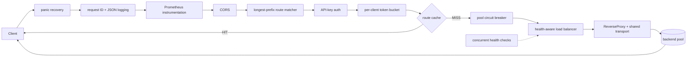

# Gatex

Gatex is a configuration-driven API gateway written in Go. It combines a
standard-library reverse proxy with concurrent, health-aware load balancing,
per-client rate limiting, circuit breaking, API-key authentication, CORS,
bounded response caching, structured logs, Prometheus metrics, health probes,
and graceful shutdown.

The project keeps the request path explicit: it uses `net/http` and
`httputil.ReverseProxy` rather than a gateway framework, and its shared state is
safe under concurrent requests and health checks.

## Features

- Longest-prefix routing to named backend pools.
- Round-robin and least-connections load balancing that skips unhealthy
  backends.
- Concurrent, periodic health checks for every pool.
- Per-pool closed/open/half-open circuit breakers.
- Per-client token-bucket rate limiting with global defaults and route
  overrides.
- Optional API-key protection and bounded TTL/LRU caching per route.
- Request IDs, JSON access logs, CORS, panic recovery, and upstream timeouts.
- Prometheus metrics plus liveness and readiness endpoints.
- Race-tested packages, integration tests, a reproducible k6 benchmark,
  container images, Docker Compose, and CI.

## Quick start

The quickest way to run Gatex is the included Docker Compose stack. It starts
the gateway and three mock backend instances. Docker with the Compose plugin is
the only prerequisite.

```sh
export GATEX_API_KEY=local-development-key
docker compose up --build -d
```

Check the gateway and exercise both a public and protected route:

```sh
curl --retry 30 --retry-all-errors --retry-delay 1 --fail \
  http://localhost:8080/readyz
curl -i http://localhost:8080/api/users
curl -i -H 'X-API-Key: local-development-key' \
  http://localhost:8080/api/orders
```

The public response's `X-Mock-Backend` header identifies the selected backend.
The protected request returns `401 Unauthorized` when `X-API-Key` is absent or
invalid.

Prometheus metrics are available at <http://localhost:8080/metrics>. Stop and
remove the local stack with:

```sh
docker compose down
```

To run the gateway binary directly, install Go 1.26.1 or newer and point it at
a configuration whose backend URLs are reachable from the host:

```sh
GATEX_CONFIG=/path/to/gateway.yaml go run ./cmd/gateway
# Equivalent: go run ./cmd/gateway -config /path/to/gateway.yaml
```

The `-config` flag takes precedence over `GATEX_CONFIG`; without either, Gatex
loads `configs/gateway.example.yaml`.

## Architecture



Process-wide middleware wraps route-specific policy. Recovery is outermost so
it can contain any panic; logging and metrics observe all gateway outcomes;
CORS handles browser preflights before authentication or quota is consumed.
After a route is selected, authentication precedes rate limiting, and the cache
runs only after both checks. A cache hit therefore obeys the same access and
quota policy as a miss while avoiding the breaker, balancer, and upstream call.

On a cache miss, the gateway applies the request deadline, obtains a circuit
breaker permit, and atomically assigns a healthy backend. It then forwards the
request through a shared, tuned `http.Transport`. The proxy records transport
errors and upstream `5xx` responses as breaker failures, releases active
connection accounting when the request completes, and preserves cancellation
through the request context.

See [the detailed architecture notes](docs/architecture.md) for middleware,
cache, logging, metrics, readiness, and package-boundary details.

## Configuration reference

Gatex reads YAML and validates the complete configuration before listening.
`${NAME}` placeholders may be used in YAML string values and are expanded from
the environment; startup fails when a referenced variable is unset. This keeps
secrets such as API keys out of committed configuration.

The complete annotated example is
[`configs/gateway.example.yaml`](configs/gateway.example.yaml).

### Top-level settings

| Field | Required | Meaning |
| --- | --- | --- |
| `listen_address` | Yes | Gateway HTTP bind address, for example `:8080`. |
| `timeouts` | No | Incoming request and upstream transport timeouts. Zero values use safe defaults. |
| `rate_limit` | No | Default token-bucket rate for routes. Set both values to zero to disable it. |
| `auth.api_keys` | For protected routes | Values accepted through `X-API-Key`; multiple values support key rotation. |
| `cors` | No | Browser origin, method, and header policy. Omit `allowed_origins` to disable CORS. |
| `backend_pools` | Yes | Named groups of interchangeable upstreams. |
| `routes` | Yes | Path prefixes mapped to backend pool names and optional route policy. |

### Timeouts

| Field | Default | Meaning |
| --- | ---: | --- |
| `timeouts.request` | `15s` | End-to-end deadline applied to an upstream request. |
| `timeouts.dial` | `2s` | TCP connection timeout. |
| `timeouts.tls_handshake` | `3s` | TLS handshake timeout. |
| `timeouts.response_header` | `5s` | Maximum wait for upstream response headers. |
| `timeouts.idle_connection` | `90s` | Idle keep-alive lifetime for server and upstream connections. |

Durations use Go syntax such as `250ms`, `15s`, or `2m`.

### Rate limiting and authentication

| Field | Meaning |
| --- | --- |
| `rate_limit.requests_per_second` | Continuous per-client token refill rate; must be paired with `burst`. |
| `rate_limit.burst` | Maximum bucket capacity and initial allowance. |
| `auth.api_keys` | Non-empty visible-ASCII API keys accepted by protected routes. |

Clients are keyed by the direct peer IP. Gatex deliberately ignores forwarded
address headers because it has no trusted-proxy configuration; accepting them
would let callers spoof limiter identities. Rejected requests return `429` with
`Retry-After`. API keys are compared in constant time and removed before the
request is sent upstream.

### CORS

| Field | Meaning |
| --- | --- |
| `cors.allowed_origins` | Exact `http`/`https` origins, or `*` when credentials are disabled. |
| `cors.allowed_methods` | Uppercase methods accepted for preflight requests. |
| `cors.allowed_headers` | Request headers accepted for preflight requests. |
| `cors.exposed_headers` | Response headers browser code may read. |
| `cors.allow_credentials` | Enables credentialed cross-origin requests; incompatible with wildcard origins. |
| `cors.max_age` | Browser preflight-cache duration. |

### Backend pools

| Field | Required/default | Meaning |
| --- | --- | --- |
| `strategy` | Required | `round_robin` or `least_connections`. |
| `backends[].url` | At least one | Absolute upstream base URL. |
| `health_check.path` | `/healthz` | Endpoint considered healthy on a `2xx` or `3xx` response. |
| `health_check.interval` | `10s` | Delay between concurrent pool health-check rounds. |
| `health_check.timeout` | `2s` | Per-backend health-check deadline. |
| `circuit_breaker.failure_threshold` | `5` | Consecutive failures that open the pool breaker. |
| `circuit_breaker.open_timeout` | `30s` | Time before the breaker admits recovery probes. |
| `circuit_breaker.half_open_max_requests` | `1` | Successful probe batch required to close the breaker; any failed probe reopens it. |

All backends begin healthy so startup does not wait for a health-check round.
Health state and active-request counters are concurrency-safe. If no backend is
healthy, or the pool breaker is open, Gatex fails fast with `503`.

### Routes

| Field | Required/default | Meaning |
| --- | --- | --- |
| `path_prefix` | Required | Segment-aware incoming path prefix. The most specific matching route wins. |
| `backend_pool` | Required | Name of the destination pool. |
| `protected` | `false` | Requires a valid `X-API-Key` when true. |
| `rate_limit` | Global value | Optional route-specific `requests_per_second` and `burst`. |
| `cache.ttl` | Cache disabled | Positive lifetime for eligible stored responses. |
| `cache.max_entries` | Cache disabled | Positive per-route LRU entry limit. |

Caching is intentionally conservative. Only bodyless `GET` requests and
complete `200 OK` responses are eligible. Personalized, conditional, partial,
encoded, non-cacheable, variant, cookie-setting, and responses larger than 1
MiB bypass storage. Eligible responses expose `X-Cache: MISS` or
`X-Cache: HIT`; request IDs are generated per request and are never cached.

## Operational endpoints

| Endpoint | Purpose |
| --- | --- |
| `GET /healthz` | Liveness: the Gatex process and handler stack are responding. |
| `GET /readyz` | Readiness: every configured pool has a healthy backend and a closed breaker. |
| `GET /metrics` | Prometheus request, latency, error, runtime, process, and breaker-state metrics. |

Gateway responses include `X-Request-ID`; a valid incoming value is preserved,
otherwise Gatex creates one. Upstream responses also include `X-Gateway: gatex`.
Access logs are JSON and contain request ID, method, path, host, remote address,
status, response size, latency, and the selected backend without credentials or
query parameters.

## Design rationale and trade-offs

- **Standard library proxy over a gateway framework.** `net/http` and
  `httputil.ReverseProxy` expose cancellation, URL rewriting, transport reuse,
  and failure handling directly. This costs more application code, but keeps
  the concurrency and request lifecycle explainable and testable.
- **Configuration-driven, static topology.** Route and backend changes require
  a restart. That avoids synchronization and partial-update problems in the
  first version; a control plane or atomic configuration reload is the next
  step for frequently changing environments.
- **Round robin and least connections serve different workloads.** Round robin
  is predictable and fair when requests have similar cost. Least connections
  adapts better to variable request duration, but requires correct active-count
  accounting and does not measure backend capacity or queued work. Neither is
  weighted in the current implementation.
- **Token bucket over sliding window.** A token bucket permits a bounded burst
  while enforcing a long-run rate, refills lazily without per-client
  goroutines, and has constant-time request handling. A sliding window gives a
  stricter view of recent request volume but needs more timestamp storage or
  approximate counters. The current limiter is per process, so horizontally
  scaled replicas multiply the effective client allowance.
- **Consecutive-failure circuit breaking.** This state machine is compact and
  reacts quickly to a hard outage. A rolling error-rate breaker would behave
  better with intermittent failures and high traffic, but needs a time window,
  minimum sample size, and more policy choices. Breakers are per pool, so one
  failing backend can contribute to protecting the whole interchangeable pool.
- **Local bounded cache over a distributed cache.** Per-route TTL/LRU caches
  avoid network hops and cross-route eviction. They are intentionally not
  coherent between instances and support no active purge, so TTL expiry or
  restart is the invalidation mechanism. Redis would trade latency and another
  dependency for shared state and coordinated invalidation.
- **Fail-closed readiness.** The instance is ready only when every configured
  pool is usable. This prevents routing traffic to an instance that cannot
  serve one of its routes, but a single optional pool can remove the whole
  instance from service. Larger deployments may need route- or dependency-tier
  readiness instead.

## At 10x traffic

The first changes would be measurement-driven rather than a rewrite:

1. Run load generation on separate hosts, profile CPU, allocations, connection
   reuse, and log-sink backpressure, then set latency and error SLOs from real
   traffic distributions.
2. Scale Gatex horizontally behind a network load balancer and move rate-limit
   and cache coordination to Redis only where global limits or shared
   invalidation are required. Keep local caches for safe, high-volume data.
3. Add weighted and latency-aware balancing, per-backend circuit breakers, and
   passive health signals so one degraded backend does not penalize its whole
   pool.
4. Bound concurrency and queues per pool, enforce request/response body limits,
   tune transport limits from measurements, and shed load before memory or
   backend saturation cascades.
5. Add atomic configuration reload or a small control plane with validation,
   staged rollout, and rollback. Store secrets in a secret manager instead of
   process environment variables.
6. Export OpenTelemetry traces, sample high-volume access logs, and alert on
   tail latency, breaker state, saturation, readiness, and upstream health.

Gatex is intentionally a single-instance learning and portfolio project today;
it does not claim distributed consistency, dynamic service discovery, or a
multi-region control plane.

## Development and verification

Run the unit and integration tests:

```sh
make test
```

Run the complete suite with the race detector and no cached results:

```sh
make test-race
```

The CI workflow also runs `go vet ./...`, `golangci-lint`, and a production
container build. Run the reproducible local k6 comparison with:

```sh
make load-test
```

The workload, overrides, recorded p50/p95/p99 baseline, and bottleneck analysis
are in [the load-test report](docs/load-test.md).
